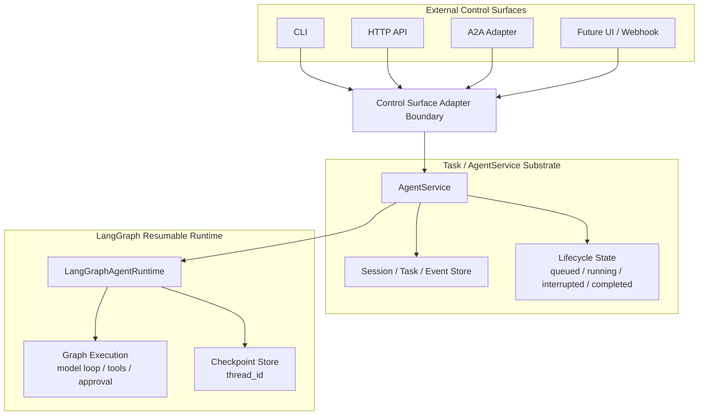
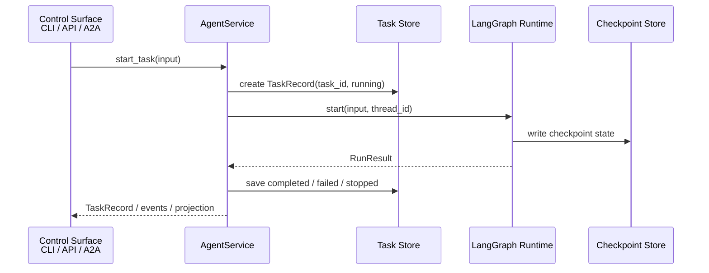
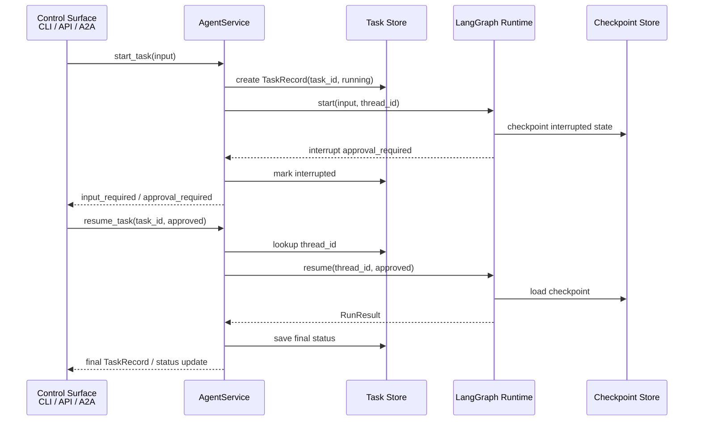

# Vermay Agent Workbench

Vermay Agent Workbench is a Python local agent workbench for running a LangGraph-based agent with visible harness behavior: context construction, model calls, tool execution, permission checks, approval interrupts, memory, skills, evaluation replay, MCP integration, and local API sessions.

The default runtime uses LangGraph with LangChain standard message and tool types, including `AIMessage.tool_calls`, `ToolMessage`, `ToolNode`, and `add_messages`.

## Architecture

Vermay Agent Workbench is organized around three layers: external control surfaces, a task substrate, and the LangGraph runtime. The important boundary is that A2A is not the agent's core execution model. A2A is one protocol surface for exposing and interacting with agent capabilities, alongside the CLI, the local HTTP API, and future UI or webhook entry points.

The Task / AgentService layer is the substrate. It owns the stable application contract: sessions, tasks, lifecycle state, events, artifacts, cancellation, retry, and resume. Protocol adapters should translate their own request and response shapes into this task model instead of reaching into LangGraph internals.

LangGraph sits below that substrate as a resumable execution runtime. It owns graph execution, model and tool loops, approval interrupts, checkpoints, and continuation through `thread_id`. The outer layers may start, observe, cancel, or resume work, but they should not expose raw graph state as their public contract.



A useful analogy is an operating system, but not as a strict one-to-one mapping. The CLI, HTTP API, and A2A adapter are like shells, RPC endpoints, or UI control surfaces: they let an outside caller submit work, inspect state, cancel, or resume. `AgentService` is closer to a process manager or job controller: it creates work records, tracks lifecycle state, coordinates persistence, and decides when execution should be resumed. LangGraph is closer to a virtual CPU or interpreter for agent execution: it advances the graph, runs model/tool steps, yields on approval interrupts, and uses checkpoints to continue later.

In that analogy, `task_id` is the external job identifier, `session_id` or A2A `contextId` is the longer-lived conversation or working context, and LangGraph `thread_id` is an internal continuation/checkpoint identifier. `thread_id` should therefore be treated as runtime state, not as the public task identity.

| OS/platform analogy | Vermay concept |
| --- | --- |
| Shell, RPC endpoint, or UI | CLI, HTTP API, A2A adapter, future UI |
| Process manager or job controller | `AgentService` |
| Process table and event log | Session / task / event store |
| Job identifier | `task_id` |
| Working context | `session_id` / A2A `contextId` |
| Continuation or checkpoint pointer | LangGraph `thread_id` |
| Virtual CPU or interpreter | `LangGraphAgentRuntime` |
| Blocking trap or cooperative yield | Approval interrupt |

Normal task execution follows this boundary: the control surface expresses the caller's request, `AgentService` turns it into a lifecycle-managed task, and LangGraph advances the agent execution.



Approval interrupts show why `task_id` and `thread_id` should stay separate. The caller resumes the externally visible task by `task_id`; `AgentService` looks up the internal LangGraph `thread_id` and resumes the checkpointed runtime state.



## Features

- LangGraph runtime with ToolNode-backed tool execution.
- Built-in tools for weather, sample DevOps data, and read-only Kubernetes inspection.
- Permission gate for dangerous tools.
- Interactive approval and durable resume with SQLite checkpoints.
- Explicit memory management.
- Markdown-based skills.
- Trace and scenario replay for evaluation.
- Ollama and OpenAI-compatible model adapters with named model selection.
- MCP client integration for explicitly selected tools, resources, and prompts.
- Local FastAPI server for agent session and task lifecycle.
- Optional local A2A-compatible task routes.

## Install

```bash
cd <repo-root>
python3 -m venv .venv
source .venv/bin/activate
python -m pip install --upgrade pip
python -m pip install -e .
```

## Quick Start

```bash
vermay-agent "weather forecast for Beijing"
```

The CLI prints a compact progress transcript to stderr and the final answer to stdout.
The legacy `mini-agent` command is still installed as a compatibility alias.

Disable progress output:

```bash
vermay-agent "weather forecast for Beijing" --no-progress
```

## API Server

Start the local API server:

```bash
vermay-agent serve
```

Defaults:

```text
host: 127.0.0.1
port: 8000
```

Override host or port:

```bash
vermay-agent serve --host 127.0.0.1 --port 9000
```

Enable the optional local A2A routes:

```bash
vermay-agent serve --enable-a2a
```

Health check:

```bash
curl http://127.0.0.1:8000/health
```

Local lifecycle endpoints are under `/api`. A2A protocol routes stay at the protocol root only when enabled.

Create a session:

```bash
curl -X POST http://127.0.0.1:8000/api/sessions \
  -H 'Content-Type: application/json' \
  -d '{"title":"Ops session"}'
```

Start a task in a session:

```bash
curl -X POST http://127.0.0.1:8000/api/sessions/<session-id>/tasks \
  -H 'Content-Type: application/json' \
  -d '{"input":"weather forecast for Beijing"}'
```

By default the request waits for the task to finish or interrupt. For long-running work, set `wait` to `false` and inspect the task later:

```bash
curl -X POST http://127.0.0.1:8000/api/sessions/<session-id>/tasks \
  -H 'Content-Type: application/json' \
  -d '{"input":"weather forecast for Beijing","wait":false}'
```

Start a task with explicit MCP selection:

```bash
curl -X POST http://127.0.0.1:8000/api/sessions/<session-id>/tasks \
  -H 'Content-Type: application/json' \
  -d '{
    "input": "debug service health",
    "mcp": {
      "servers": ["k8s"],
      "prompts": [{"server": "k8s", "name": "k8s-service-health-check"}],
      "resources": [{"server": "k8s", "uri": "k8s://cluster/services"}]
    }
  }'
```

Inspect a task:

```bash
curl http://127.0.0.1:8000/api/tasks/<task-id>
```

Stream task lifecycle events:

```bash
curl -N http://127.0.0.1:8000/api/tasks/<task-id>/stream
```

Cancel a task:

```bash
curl -X POST http://127.0.0.1:8000/api/tasks/<task-id>/cancel \
  -H 'Content-Type: application/json' \
  -d '{"reason":"operator requested"}'
```

Retry a completed, failed, stopped, or canceled task as a new task:

```bash
curl -X POST http://127.0.0.1:8000/api/tasks/<task-id>/retry \
  -H 'Content-Type: application/json' \
  -d '{"reason":"try again"}'
```

Resume an approval interrupt:

```bash
curl -X POST http://127.0.0.1:8000/api/tasks/<task-id>/resume \
  -H 'Content-Type: application/json' \
  -d '{"approved":true,"reason":"approved by operator"}'
```

The API is local-only by default and does not add authentication. Bind it carefully if exposing it outside the local machine.

API MCP selection uses structured objects and is stored as task metadata. Approval resume reuses the same selected MCP servers, prompts, and resources.

When A2A routes are enabled, the local server also exposes:

```text
GET  /.well-known/agent-card.json
POST /message:send
GET  /tasks/<task-id>
POST /tasks/<task-id>:cancel
POST /tasks/<task-id>:subscribe
```

The A2A routes project existing session, task, event, and artifact records. They do not expose LangGraph `thread_id`, raw graph state, raw prompts, raw model output, or full tool output.

## Model Configuration

The runtime selects a configured model from `config/models.json`. The file defines a `primary_model` and a map of named model configurations:

```json
{
  "primary_model": "local_ollama",
  "models": {
    "local_ollama": {
      "provider": "ollama",
      "options": {
        "model": "deepseek-v4-flash:cloud",
        "base_url": "http://127.0.0.1:11434",
        "timeout_seconds": 120
      }
    },
    "openai_gpt4o": {
      "provider": "openai_compatible",
      "options": {
        "model": "gpt-4o",
        "base_url": "https://api.openai.com/v1",
        "api_key_env": "OPENAI_API_KEY",
        "timeout_seconds": 120
      }
    }
  }
}
```

Use the primary model:

```bash
vermay-agent "weather forecast for Beijing"
```

Use another configured model:

```bash
vermay-agent "weather forecast for Beijing" --model local_ollama
```

API tasks can also select a configured model by name:

```json
{
  "input": "weather forecast for Beijing",
  "model": "openai_gpt4o"
}
```

### Provider Notes

Ollama model settings should be configured under the selected model's `options`.

OpenAI-compatible models use OpenAI-style `/chat/completions` endpoints, including OpenAI and vLLM-compatible services. Optional authentication can be passed through `api_key` or through an environment variable named by `api_key_env`.

The OpenAI-compatible adapter follows the Chat Completions tool-calling shape:

- Requests are sent to `{base_url}/chat/completions`.
- Authentication uses `Authorization: Bearer <api_key>` when `api_key` or `api_key_env` is configured.
- When tools are available, requests include standard `tools` entries and `tool_choice: auto`.
- When no tools are available, `tools` and `tool_choice` are omitted.
- Tool call history is preserved using assistant `tool_calls` and `role: tool` messages with `tool_call_id`.

This OpenAI-specific message shape is not applied to Ollama. The Ollama adapter continues to use the project's JSON action protocol for final answers and tool calls.

## Approval

Dangerous tools pause the graph and require approval.

In an interactive terminal, approval is prompted automatically:

```bash
vermay-agent "apply this kubernetes manifest: ..."
```

Manual resume is available for low-level local checkpoint workflows:

```bash
vermay-agent --thread-id <thread-id> --resume-approval true --approval-reason "approved by operator"
```

This CLI path resumes the internal LangGraph checkpoint directly by `thread_id`. API and A2A surfaces resume work through the externally visible `task_id`.

LangGraph checkpoints are stored under `data/checkpoints/`.

## Memory

Memory is written explicitly by command. Enabled memory can be injected into later runs when it matches the request.

```bash
vermay-agent memory add "Prefer read-only Kubernetes inspection first." --tag k8s --tag preference
vermay-agent memory list
vermay-agent memory disable 1
```

Memory metadata is stored in `data/agent.sqlite`.

## Skills

Skills are markdown files under `skills/` with front matter:

```markdown
---
name: kubernetes-readonly-debug
description: Read-only Kubernetes status inspection.
triggers: k8s, kubernetes, pods, services
version: 0.1.0
---

Prefer read-only inspection before proposing a fix.
```

Common commands:

```bash
vermay-agent skills list
vermay-agent skills show kubernetes-readonly-debug
vermay-agent skills propose-from-trace --trace traces/latest.jsonl
vermay-agent skills approve <proposal-id>
```

Approved skills live in `skills/`. Generated proposals live in `data/skill_proposals/`.

## Offline Evaluation Replay

Replay evaluates a recorded trace or scenario without executing a live model or live tools.

```bash
vermay-agent eval replay --trace traces/latest.jsonl
vermay-agent eval replay --scenario evals/scenarios/weather.json
vermay-agent eval list-runs
```

Run metadata is stored in `data/agent.sqlite`. Full reports are written to `data/eval_runs/`.

## MCP Tools, Resources, and Prompts

MCP client configuration lives in `config/mcp_servers.json`.

List configured MCP servers and capabilities:

```bash
vermay-agent mcp list-servers
vermay-agent mcp list-tools
vermay-agent mcp list-tools --server k8s
vermay-agent mcp list-resources --server k8s
vermay-agent mcp list-prompts --server k8s
```

Configured MCP servers are inactive by default during agent runs. Select a server explicitly:

```bash
vermay-agent "check k8s status" --mcp-server k8s
vermay-agent "check service status" --mcp-server k8s --mcp-resource k8s://cluster/services
vermay-agent "debug service health" --mcp-server k8s --mcp-prompt k8s-service-health-check
vermay-agent "debug phzou-core service" --mcp-server k8s --mcp-prompt 'k8s-service-health-check?service=phzou-core&namespace=default'
```

Selected MCP tools are wrapped as LangChain `StructuredTool` instances with namespaced model-facing names such as `mcp__k8s__kubectl_get`. MCP tools require approval by default unless the server or tool is marked read-only in config.

Selected MCP prompts and resources are read once at run start. Prompts are injected as bounded external workflow guidance; resources are injected as bounded external data. Prompt arguments use query-string syntax after the prompt name. When multiple MCP servers are selected, use qualified forms such as `--mcp-prompt 'k8s:k8s-service-health-check?service=phzou-core'` and `--mcp-resource k8s:k8s://cluster/services`.

A local read-only Kubernetes MCP test example exists under `examples/mcp_servers/k8s/`. It uses the existing SSH/microk8s backend and the existing `MINI_AGENT_SSH_*` environment configuration. `config/mcp_servers.json` starts it with `.venv/bin/python` and applies `timeout_seconds` to MCP discovery, tool calls, resources, and prompts. Adjust the command if using a different Python environment.

## Documentation

Project documentation is under [docs/README.md](docs/README.md).

## Tests

```bash
.venv/bin/python -m pytest
```
