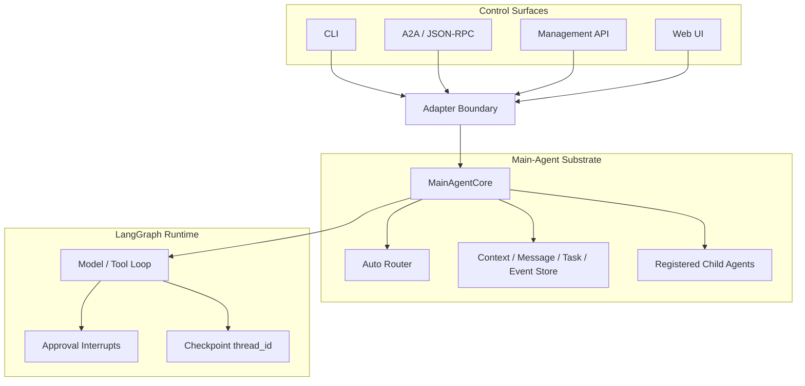
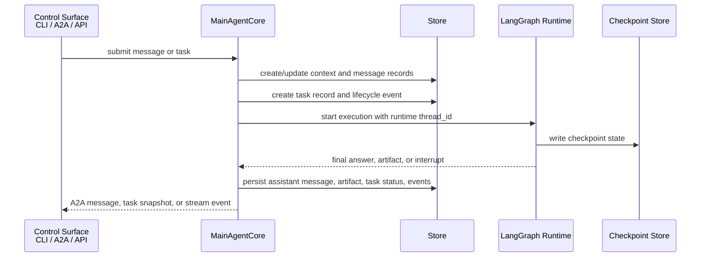
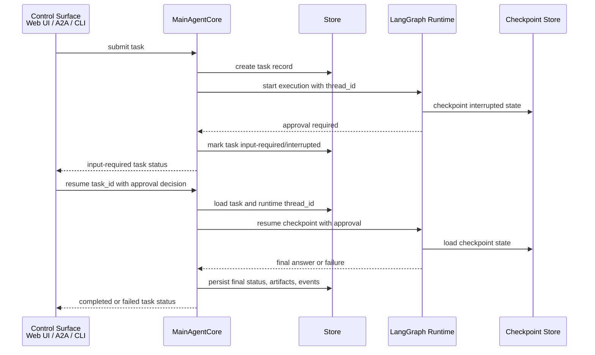
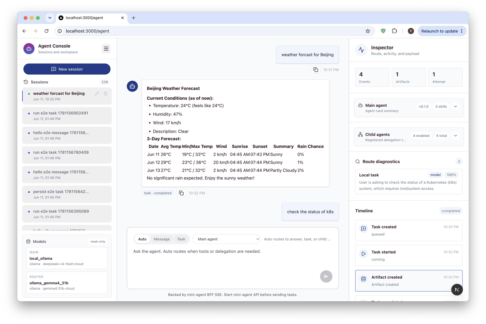

# Vermay Agent Workbench

Vermay Agent Workbench is an A2A-first local main-agent workbench. It exposes a main agent that can:

- answer lightweight requests directly as messages;
- run local LangGraph-backed tasks with events, artifacts, approval interrupts, cancellation, and resume;
- route suitable requests to registered child A2A agents;
- support a browser workbench for session transcripts, route diagnostics, task events, payload inspection, and approval controls.

The public service boundary is A2A-first. New integrations should use the canonical `/rpc` JSON-RPC endpoint.

## Architecture

The project keeps protocol, task state, and runtime execution as separate layers.



Key identifiers:

| Concept | Meaning |
| --- | --- |
| `context_id` / `session_id` | Long-lived conversation/work context. |
| `message_id` | User or agent message identity inside a context. |
| `task_id` | Public task identity used by A2A, UI, cancel, subscribe, and resume flows. |
| `thread_id` | Internal LangGraph checkpoint continuation pointer. Treat it as runtime state, not public identity. |

Approval resume follows this rule: external callers resume by `task_id`; `MainAgentCore` looks up the runtime `thread_id` and resumes the checkpointed LangGraph execution.

### Task Execution Flow

Normal execution starts at a control surface, becomes a lifecycle-managed task, and then advances through the LangGraph runtime. The public task record and event stream stay outside the raw graph state.



### Approval Resume Flow

Approval interrupts keep `task_id` and `thread_id` separate. The caller resumes the externally visible `task_id`; the main-agent layer looks up the internal checkpoint thread and resumes the runtime.



## UI Preview

The current Web UI is a chat-first Agent Console: sessions on the left, the conversation transcript and composer in the center, and an inspector for route diagnostics, task events, agent cards, child agents, and payloads on the right.



The UI is currently documented as part of the product direction and will be moved into this repository in a later milestone. This repository currently contains the Python backend, CLI, runtime, storage, and A2A service.

## Install

```bash
python3 -m venv .venv
source .venv/bin/activate
python -m pip install --upgrade pip
python -m pip install -e .
```

Python 3.11 or newer is required.

## CLI Quick Start

```bash
vermay-agent "weather forecast for Beijing"
```

The CLI prints progress to stderr and the final answer to stdout.

Disable progress output:

```bash
vermay-agent "weather forecast for Beijing" --no-progress
```

The legacy `mini-agent` command is still installed as a compatibility alias.

## Start The Backend

```bash
source .venv/bin/activate
vermay-agent serve
```

Defaults:

```text
host: 127.0.0.1
port: 8000
```

`serve` exposes A2A routes by default. Disable A2A only when you explicitly need management APIs without the public A2A surface:

```bash
vermay-agent serve --disable-a2a
```

Health check:

```bash
curl http://127.0.0.1:8000/health
```

The service is local-only by default and does not add authentication. Be careful before binding it outside localhost.

## Deterministic Dev Mode

Use dev mock mode for protocol smoke tests and UI development when you want stable outputs without live model/tool variance:

```bash
source .venv/bin/activate
vermay-agent serve --dev-mock-main-agent --host 127.0.0.1 --port 8000
```

Run backend smoke checks:

```bash
scripts/a2a_dev_smoke.sh
```

## A2A `/rpc` Examples

Path-style A2A routes remain available for compatibility, but `/rpc` is the preferred integration surface.

Send a direct message:

```bash
curl -X POST http://127.0.0.1:8000/rpc \
  -H 'Content-Type: application/json' \
  -d '{
    "jsonrpc": "2.0",
    "id": "req-1",
    "method": "SendMessage",
    "params": {
      "message": {
        "kind": "message",
        "role": "user",
        "messageId": "msg-1",
        "parts": [{"kind": "text", "text": "tell me a joke"}]
      },
      "metadata": {"executionMode": "message"}
    }
  }'
```

Run a task:

```bash
curl -X POST http://127.0.0.1:8000/rpc \
  -H 'Content-Type: application/json' \
  -d '{
    "jsonrpc": "2.0",
    "id": "req-2",
    "method": "SendMessage",
    "params": {
      "message": {
        "kind": "message",
        "role": "user",
        "messageId": "msg-2",
        "parts": [{"kind": "text", "text": "check k8s status"}]
      },
      "metadata": {"executionMode": "task"}
    }
  }'
```

Use auto routing:

```bash
curl -X POST http://127.0.0.1:8000/rpc \
  -H 'Content-Type: application/json' \
  -d '{
    "jsonrpc": "2.0",
    "id": "req-3",
    "method": "SendMessage",
    "params": {
      "message": {
        "kind": "message",
        "role": "user",
        "messageId": "msg-3",
        "parts": [{"kind": "text", "text": "delete pod nginx only after approval"}]
      },
      "metadata": {"executionMode": "auto"}
    }
  }'
```

Inspect a task:

```bash
curl -X POST http://127.0.0.1:8000/rpc \
  -H 'Content-Type: application/json' \
  -d '{"jsonrpc":"2.0","id":"req-4","method":"GetTask","params":{"id":"<task-id>"}}'
```

Cancel a task:

```bash
curl -X POST http://127.0.0.1:8000/rpc \
  -H 'Content-Type: application/json' \
  -d '{"jsonrpc":"2.0","id":"req-5","method":"CancelTask","params":{"id":"<task-id>","reason":"operator canceled"}}'
```

## Model Configuration

Models are configured in `config/models.json`.

```json
{
  "primary_model": "local_ollama",
  "router_model": "ollama_gemma4_31b",
  "models": {
    "local_ollama": {
      "provider": "ollama",
      "options": {
        "model": "deepseek-v4-flash:cloud",
        "base_url": "http://127.0.0.1:11434",
        "timeout_seconds": 120
      }
    },
    "ollama_gemma4_31b": {
      "provider": "ollama",
      "options": {
        "model": "gemma4:31b-cloud",
        "base_url": "http://127.0.0.1:11434",
        "timeout_seconds": 120
      }
    }
  }
}
```

`primary_model` is used for normal message and task execution.

`router_model` is used by `executionMode=auto` to classify whether a request should become:

- `local_message`;
- `local_task`;
- `remote_agent`.

If `router_model` is omitted, the router falls back to `primary_model`. `VERMAY_AGENT_ROUTER_MODEL` can temporarily override the configured router model for local experiments.

Use another configured model from the CLI:

```bash
vermay-agent "weather forecast for Beijing" --model local_ollama
```

## MCP Tools, Resources, And Prompts

MCP server configuration lives in `config/mcp_servers.json`.

List configured capabilities:

```bash
vermay-agent mcp list-servers
vermay-agent mcp list-tools
vermay-agent mcp list-resources --server k8s
vermay-agent mcp list-prompts --server k8s
```

Configured MCP servers are inactive by default during agent runs. Select servers explicitly:

```bash
vermay-agent "check k8s status" --mcp-server k8s
vermay-agent "debug phzou-core service" --mcp-server k8s --mcp-prompt 'k8s-service-health-check?service=phzou-core&namespace=default'
```

Selected MCP tools are wrapped as LangChain `StructuredTool` instances with namespaced names such as `mcp__k8s__kubectl_get`. MCP tools require approval by default unless the server or tool is marked read-only.

The local Kubernetes MCP example is under `examples/mcp_servers/k8s/`. It uses the preferred `VERMAY_AGENT_SSH_*` environment configuration. The deprecated `MINI_AGENT_SSH_*` prefix is still accepted as a migration fallback.

## Approval And Resume

Dangerous tools pause execution and require explicit approval.

In the Web UI, an input-required task renders approval controls directly in the transcript.

In an interactive terminal, approval is prompted automatically:

```bash
vermay-agent "delete pod nginx-5869d7778c-687rb"
```

Low-level checkpoint resume is still available through the CLI:

```bash
vermay-agent --thread-id <thread-id> --resume-approval true --approval-reason "approved by operator"
```

That CLI path resumes the internal LangGraph checkpoint directly by `thread_id`. A2A and Web UI flows resume externally visible work by `task_id`.

LangGraph checkpoints are stored under `data/checkpoints/`.

## Memory

Memory is explicit and stored locally in SQLite.

```bash
vermay-agent memory add "Prefer read-only Kubernetes inspection first." --tag k8s --tag preference
vermay-agent memory list
vermay-agent memory disable 1
```

Memory metadata is stored in `data/agent.sqlite`.

## Skills

Skills are markdown files under `skills/` with front matter:

```markdown
---
name: kubernetes-readonly-debug
description: Read-only Kubernetes status inspection.
triggers: k8s, kubernetes, pods, services
version: 0.1.0
---

Prefer read-only inspection before proposing a fix.
```

Common commands:

```bash
vermay-agent skills list
vermay-agent skills show kubernetes-readonly-debug
vermay-agent skills propose-from-trace --trace traces/latest.jsonl
vermay-agent skills approve <proposal-id>
```

Approved skills live in `skills/`. Generated proposals live in `data/skill_proposals/`.
